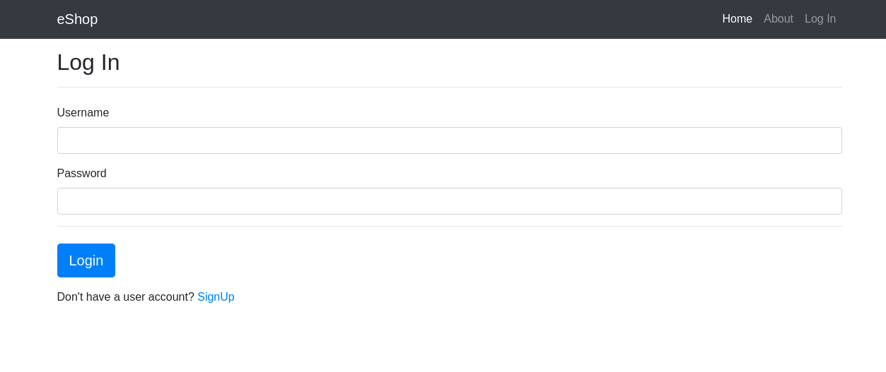

## eShop
### This is a e-commarce websit
### Java Servlet, JSP, JUnit, Lockback, SHA-256, HikariCP, MySql and Bootstrap are used to build this project

#### In this website user can add products to cart, if user can't login first user need to login, for login user need to signup than user add product to cart

#### Home Page with login and without login

